# 基于ACS集群的大模型微调文档

## 支持功能
1. 一站式部署  
支持ECS/ACK/ACS多种部署方式，自动配置LLaMA-Factory、Jupyter、SwanLab环境及OSS存储。
2. 完整微调流程  
基模选择 → 模型微调 → 效果验证 → 模型导出 → 一键部署上线。

## 模型微调实例部署
1. 进入[计算巢模型市场](https://computenest.console.aliyun.com/ai-lab/model/cn-hangzhou)，点击模型微调，进入实例部署页面

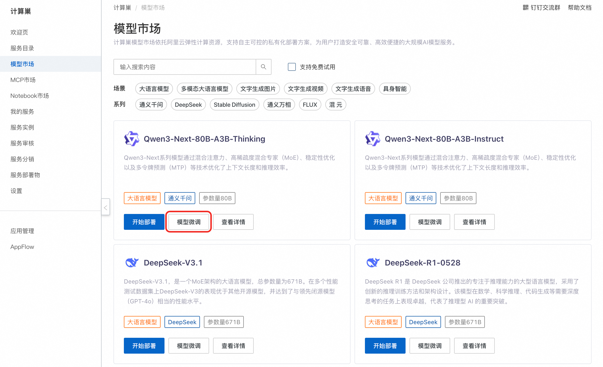

2. 选择参数完成部署

- ECS:
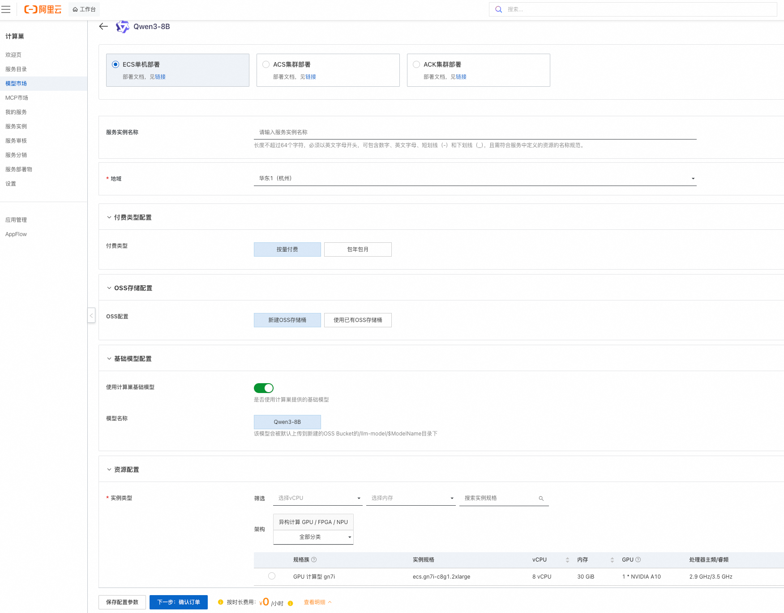

- ACS: 
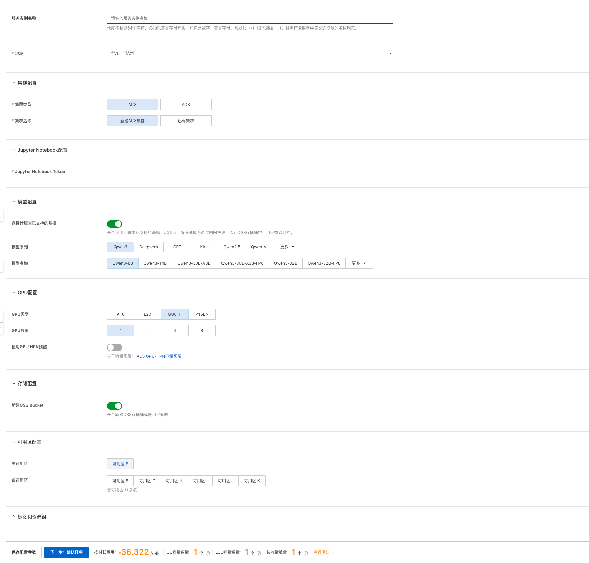

3. 部署后等待部署完成查看服务实例的输出，包括Jupyter Notebook链接和Token，LLaMA-Factory链接。

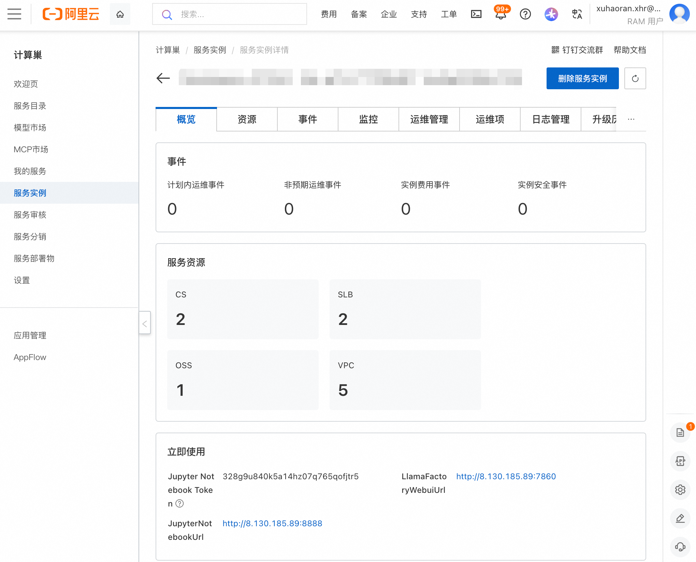

### 模型微调/训练
点击部署完时候后获取的LLaMA-Factory链接，进入Llama-Factory页面，完成后续的模型训练、验证等操作。
#### 模型选择
+ 指定已有模型：

例如创建服务实例时选择的基模为Qwen/Qwen3-8B，那么ModelPath就可设置为 `/llm-model/Qwen/Qwen3-8B`。该路径有两部分组成：`/llm-model` 为固定路径、`Qwen/Qwen3-8B` 为模型名称，该名称可以从实例部署参数中获取。

+ 选择下载模型：

LLaMA-Factory 支持直接从 Hugging Face 和 ModelScope 下载模型。但需要注意：当实例部署地域为中国地域时，由于网络问题从 Hugging Face 下载可能会报错。

下面以 Qwen3-8B 作为基础模型，训练数据集采用 glaive_toolcall_zh_demo 为例：

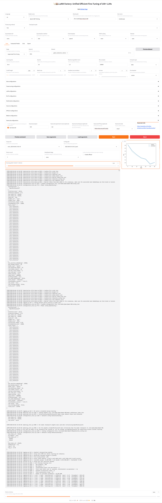

### 模型验证
验证模型可以从数据集中选择验证数据集，数据集可以采用 LLaMA-Factory 自带的，也可以直接上传到挂载目录，然后选择指定的目录数据集，下面介绍如何进行验证：

#### 通过验证集验证：
1. 点击`Evaluate&Validate`
2. 选择数据集，
    1. 如果是采用 LLaMa-Factory 自带的数据集，可以默认选择
    2. 如果需要采用自定义数据集，则需要手动指定数据集目录，然后在页面选择该目录中的验证数据集。具体操作与数据集类似，参考：[https://aliyuque.antfin.com/xuhaoran.xhr/ipqgt7/lqrdn2kl0my1ryuz#nC1IG](#nC1IG)
3. 点击验证

#### 交互页面直接chat验证
1. 点击`Chat`按钮
2. 选择 checkpoint（表示刚刚模型训练的保存点），并点击`load model`开始加载模型。
3. 加载模型完成后会出现 Chat 页面，输入 prompt 进行测试即可。

### 模型导出
模型训练完成并验证通过后，可以将模型导出到 OSS 挂载目录，挂载目录为：`/llm-model/models`

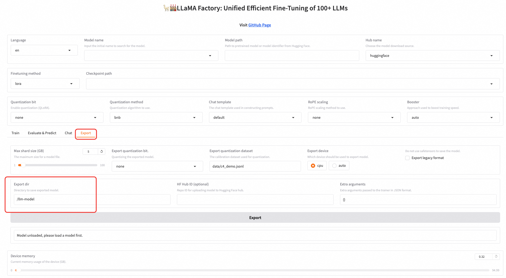

### 数据集（训练和验证）
方式一：通过配置文件新增数据集 URL

对于采用 ModelScope 或 Hugging Face 的数据集，可以直接修改 `LLaMA-Factory/data/dataset_info.json`，新增数据集的 URL 等配置。例如：新增一个 ModelScope 的 `helloworld0/Brain_teasers` 数据集：

1. 进入计算巢服务实例页面，并点击 Notebook 的链接，进入 Jupyter Notebook 页面。

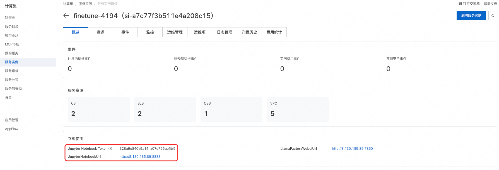

进入 Jupyter 后输入计算巢实例中返回的 Jupyter Notebook Token，随后点击旁边的 `Log in` 按钮。

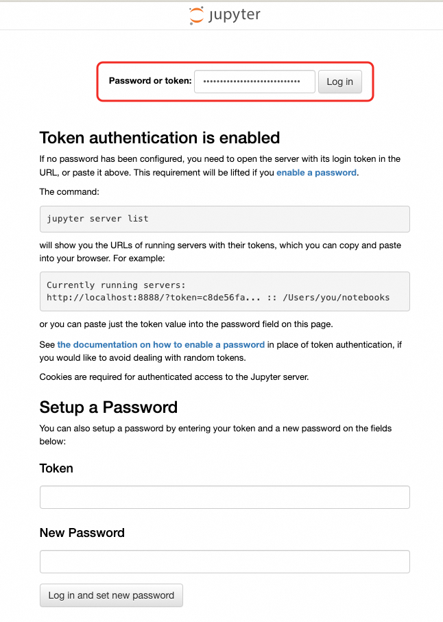

2. 进入 `LLaMA-Factory/data` 目录，并右击 `dataset_info.json`，选择 editor

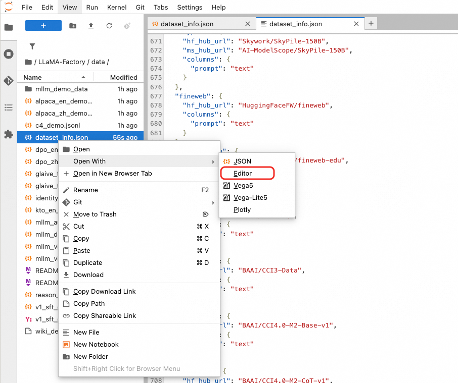

3. 新增数据集配置

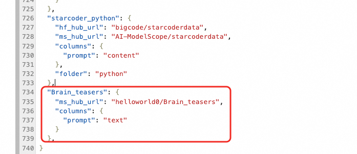

4. 编辑完后进入 LLaMA-Factory 页面选择数据集

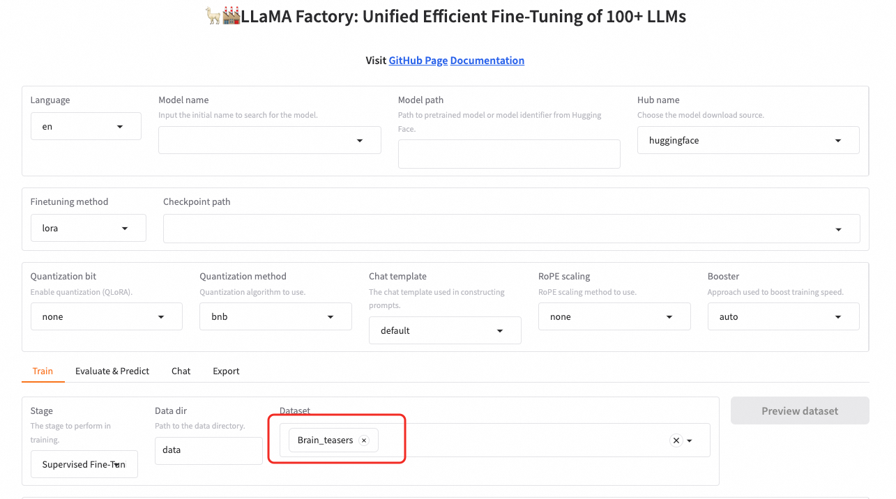

方式二：在 Notebook 中手动下载数据集

1. 进入 Jupyter Notebook 页面。
2. 点击 New Terminal 创建一个新的命令行页面

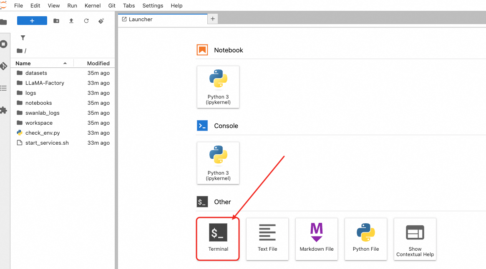

3. 执行 ModelScope、wget 等命令下载数据集到 `/llm-model` 中指定的目录，例如 `/llm-model/datasets`。例如下载 ModelScope 上的指定数据集 [tomyzcf/qwen3-finetune-test](https://modelscope.cn/datasets/tomyzcf/qwen3-finetune-test/files)，执行如下命令：

```bash
cd /llm-model/datasets
modelscope download --dataset helloworld0/Brain_teasers --local_dir ./
```

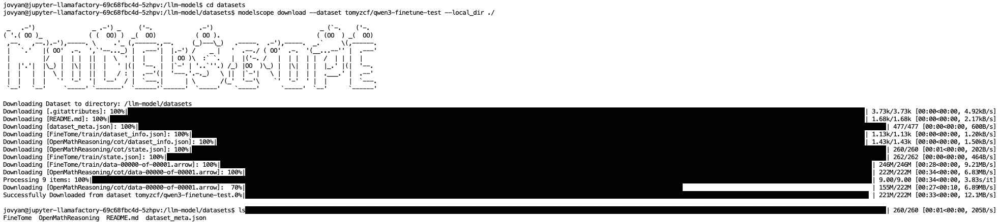

4. 如果 `/llm-model/datasets` 目录中没有 `dataset_info.json` 文件，需要新建该文件，并加入对应的配置：

```json
{
  "Brain_teasers": {
    "filename": "data.json",
    "columns": {
      "prompt": "text"
    }
  }
}
```

5. 进入 LLaMA-Factory 页面选择数据集

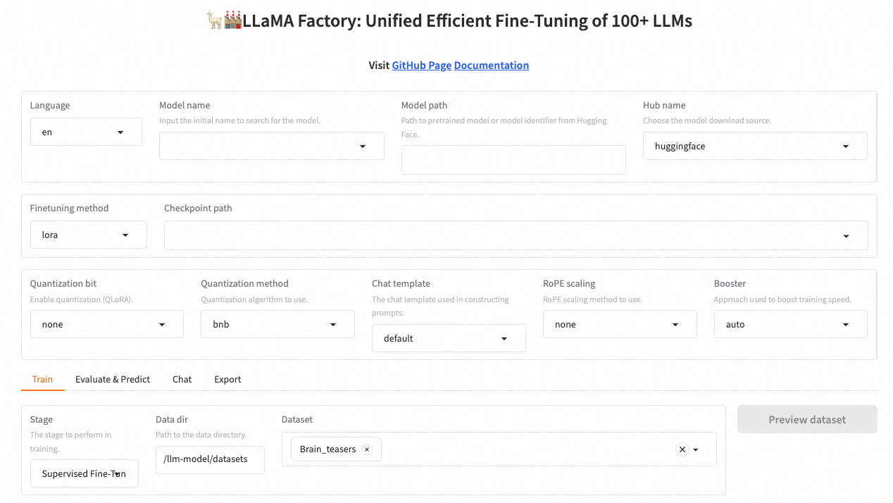

方式三：直接上传到 OSS 后指定数据集目录

1. OSS Bucket 的 `/llm-model` 目录默认会挂载到容器的 `/llm-model` 目录。可以采用 ossutil 工具手动将文件上传到 OSS `/llm-model` 目录，这样便可以在容器中获取到该数据。
2. 最后在 LLaMA-Factory 中指定数据集目录和具体的数据集。


### 可视化训练追踪
部署服务实例时会自动安装 SwanLab，方便模型微调可视化。SwanLab 支持多端同时查看模型微调状态，包括手机、Windows 等。使用方式如下：

1. 登录 SwanLab 官网：[https://swanlab.cn/](https://swanlab.cn/space/~)，如果没有账号需要先注册。
2. 获取 SwanLab API Key，如下所示

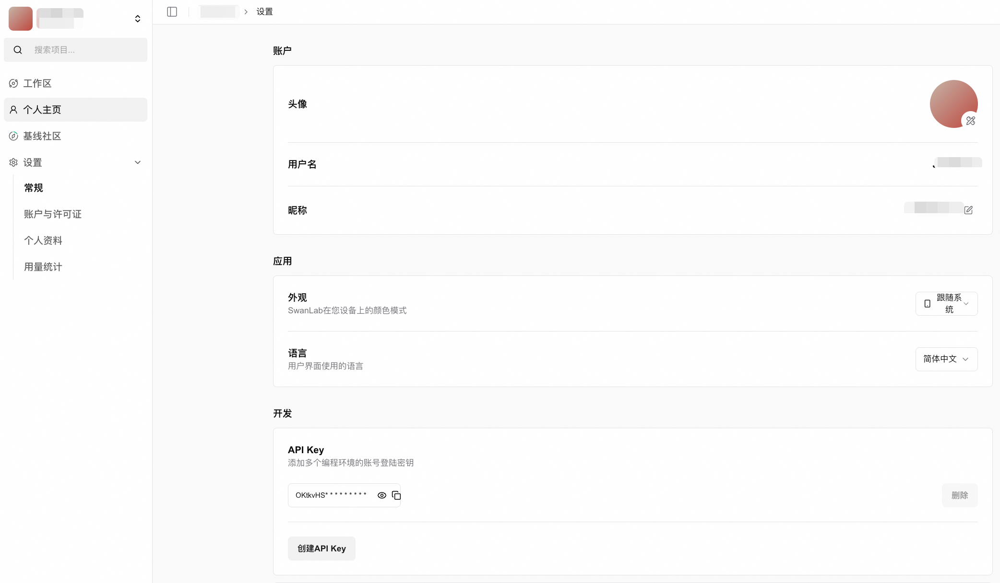

3. 在 SwanLab 中创建 Project，例如可以创建一个名为 llamafactory 的 Project。
4. 在 LLaMA-Factory 部署时选择 SwanLab 可视化，并填写基本信息，如下所示：

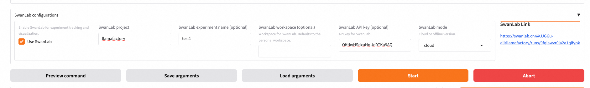

5. 当训练开始后可在 SwanLab 的 Web UI 上查看训练过程。

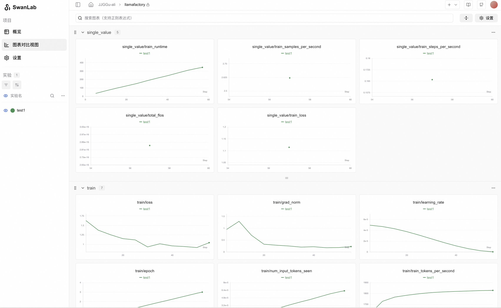

## 模型部署结合微调
当模型微调验证通过后，可直接导出到挂载的 OSS 目录 `/llm-model` 或其子目录，随后通过计算巢提供的模型推理服务快速部署该微调后的模型。下面做详细说明：

1. 通过计算巢模型微调后，将模型导出到 `/llm-model/models` 目录（该目录为 OSS 的挂载目录）。例如导出时设置 Export dir 为 `/llm-model/models/Qwen3-8B-test/`，如下所示：

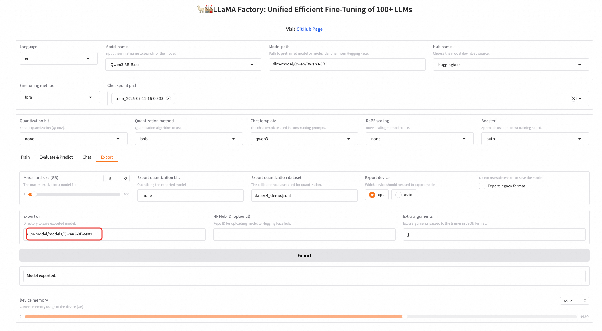

导出完成后可以在 OSS bucket 中看到该模型：

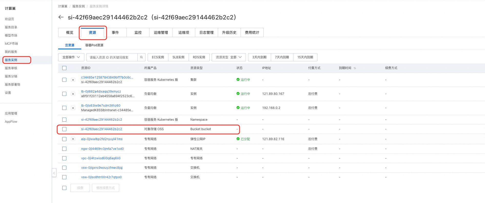

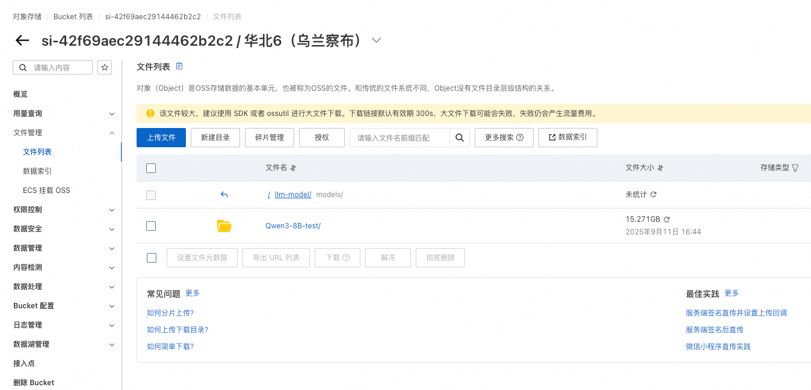

2. 使用计算巢推理服务部署服务实例。部署时可以选择已有集群和已有 OSS bucket，点击该链接部署：[部署推理服务](https://computenest.console.aliyun.com/service/instance/create/cn-hangzhou?type=user&ServiceId=service-c8bf02afe7544025be47)。参数选择如下：

| 参数名称 | 选择值 |
| --- | --- |
| 地域 | 与模型微调所选地域一致 |
| 集群选项 | 已有集群（也支持新建集群） |
| K8s 集群 ID | 选择与模型微调一致的 ACS 集群 |
| OSS Bucket 选项 | 已有 Bucket |
| 已有 OSS Bucket 名称 | 选择与模型微调一致的 Bucket |
| 模型系列 | Custom |
| 自定义模型路径 | 选择刚导出的模型路径 |
| 容器镜像 | 根据实际情况调整 |
| 部署脚本 | 根据实际情况调整 |

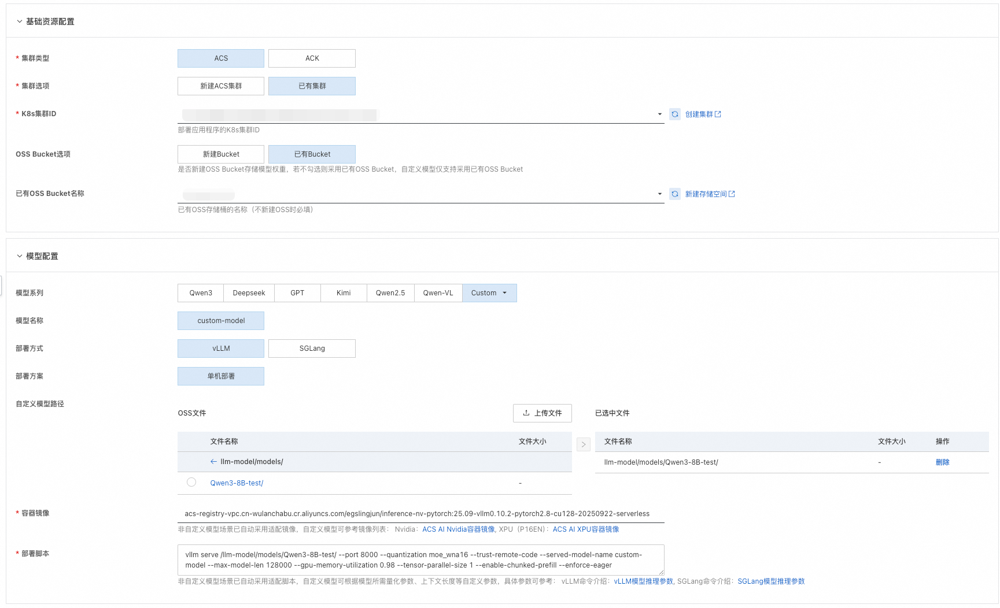

3. 点击下一步，等待部署完成后进行访问。

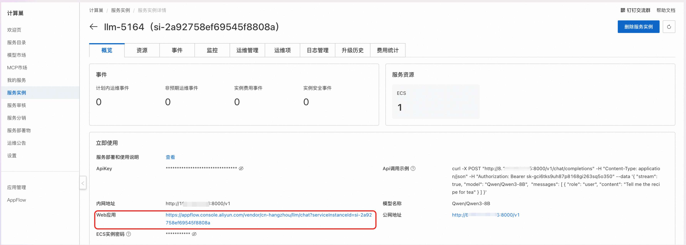

## 其他
### 微调报错怎么查
方式 1：查看容器日志

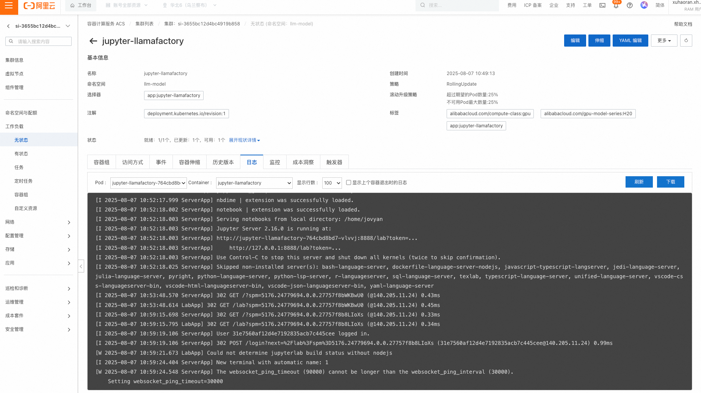

方式 2：在 Jupyter Notebook 执行查看日志命令

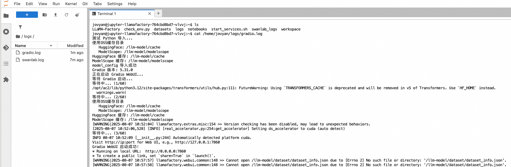

### 服务网址无法打开排查
当服务由于某些原因崩溃时，可以采用下面的方案进行排查和重启：

### ECS 部署
1. 登录 ECS（会话管理方式或者 Workbench）。
2. 查看容器状态，执行 `docker ps` 查看容器状态。

```bash
root@iZ2zeifk65wurg3nazwow4Z:~# docker ps
CONTAINER ID   IMAGE                                                                                     COMMAND                  CREATED          STATUS          PORTS                                                                                  NAMES
8df508515468   compute-nest-registry.cn-hangzhou.cr.aliyuncs.com/computenest-test/llama-factory:v1.1.1   "/usr/local/bin/entr…"   15 minutes ago   Up 15 minutes   0.0.0.0:7860->7860/tcp, :::7860->7860/tcp, 0.0.0.0:8888->8888/tcp, :::8888->8888/tcp   LLama-Factory
```

3. 查看日志：
    1. 执行 `docker logs [containerId]` 查看容器日志。

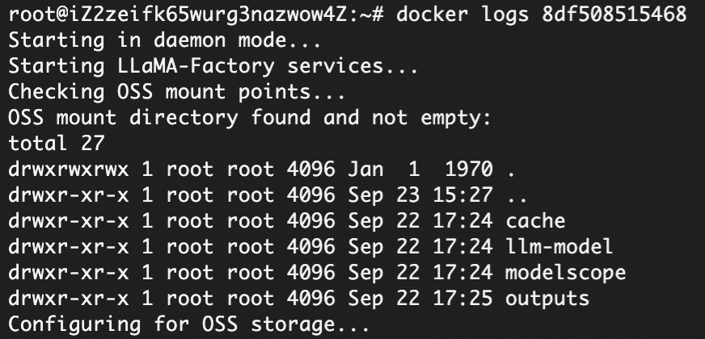

    2. 也可以执行 `docker exec -it [containerId] /bin/bash` 进入容器查看 Web UI 日志和 Jupyter 日志，日志所在目录：`/tmp`。

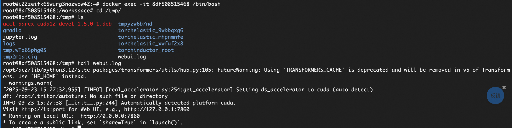

4. 重启服务（以下命令均可重启）：

```bash
systemctl restart finetune
```

```bash
docker restart LLama-Factory
# 或者
docker restart [ContainerId]
```